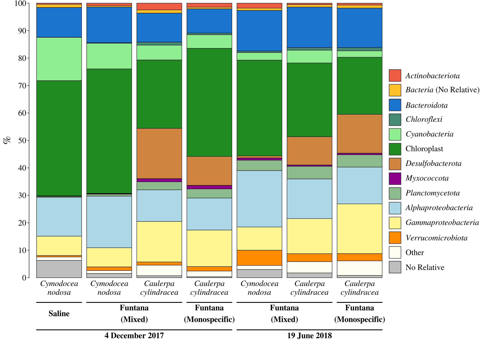

```{r knitr_settings, eval=TRUE, echo=FALSE, cache=FALSE}
opts_chunk$set("tidy" = TRUE)
opts_chunk$set("echo" = FALSE)
opts_chunk$set("eval" = TRUE)
opts_chunk$set("warning" = FALSE)
opts_chunk$set("cache" = FALSE)
opts_chunk$set("message" = FALSE)

inline_hook <- function(x){
	print(x)

	if(is.list(x)){
		x <- unlist(x)
	}

	if(is.numeric(x)){
		if(abs(x - round(x)) < .Machine$double.eps^0.5){
			paste(format(x,big.mark=',', digits=0, scientific=FALSE))
		} else {
			paste(format(x,big.mark=',', digits=1, nsmall=1, scientific=FALSE))
		}
	} else {
    	paste(x)      
	}
}
knitr::knit_hooks$set(inline=inline_hook)
```

\vspace{20mm}
Marino Korlević^1$*$^, Marsej Markovski^1^, Zihao Zhao^2^, Gerhard J. Herndl^2,3,4^, Mirjana Najdek^1^

1\. Center for Marine Research, Ruđer Bošković Institute, Croatia

2\. Department of Functional and Evolutionary Ecology, University of Vienna, Austria

3\. NIOZ, Department of Marine Microbiology and Biogeochemistry, Royal Netherlands Institute for Sea Research, Utrecht University, The Netherlands

4\. Vienna Metabolomics Center, University of Vienna, Austria

^$*$^To whom correspondence should be addressed:

Marino Korlević

G. Paliaga 5, 52210 Rovinj, Croatia

Tel.: +385 52 804 768

Fax: +385 52 804 780

e-mail: marino.korlevic@irb.hr

Running title: DNA and protein isolation from macrophyte surfaces

\newpage
\linenumbers
\sisetup{mode=text}
\setlength\parindent{24pt}
\doublespacing

## Abstract
Studies of unculturable microbes often combine methods such as 16S rRNA sequencing, metagenomics and metaproteomics. To apply these techniques to the microbial community inhabiting the surfaces of marine macrophytes it is advisable to perform a selective DNA and protein isolation prior to the analysis to avoid biases due to the host material being present in high quantities. Two protocols for DNA and protein isolation were adapted for selective extractions of DNA and proteins from epiphytic communities inhabiting the surfaces of two marine macrophytes, the seagrass *Cymodocea nodosa* and the macroalga *Caulerpa cylindracea*. Protocols showed an almost complete removal of the epiphytic community regardless of the sampling season, station, settlement or host species. The obtained DNA was suitable for metagenomic and 16S rRNA sequencing, while isolated proteins could be identified by mass spectrometry. Low presence of host DNA and proteins in the samples indicated a high specificity of the protocols. The procedures are based on universally available laboratory chemicals making the protocols widely applicable. Taken together, the adapted protocols ensure an almost complete removal of the macrophyte epiphytic community. The procedures are selective for microbes inhabiting macrophyte surfaces and provide DNA and proteins applicable in 16S rRNA sequencing, metagenomics and metaproteomics.

\newpage
## Introduction
Surfaces of marine macrophytes are colonized by a diverse microbial community whose structure and function are poorly understood [@Egan2013]. As less than 1 % of all prokaryotic species are culturable, molecular methods such as 16S rRNA sequencing, metagenomics and metaproteomics are indispensable to study these organisms [@Amann1995; @Su2012]. Applying these techniques requires an initial isolation step with the purpose of obtaining high quality DNA and proteins.

Biological material (i.e., proteins and DNA) from pelagic microbial communities is usually isolated by collecting cells onto filters and subsequently isolating the target organisms or communities [@Gilbert2009]. If a specific microbial size fraction is aimed sequential filtration is applied [@Massana1997; @Andersson2010]. In contrast, obtaining microorganisms associated to surfaces require either a cell detachment procedure prior to isolation or the host material is co-extracted with the target material. Methods for separating microbial cells from the host include shaking of host tissue [@Gross2003; @Noges2010], scraping of macrophyte surfaces [@Uku2007] or applying ultrasonication [@Weidner1996; @Cai2014]. It was shown that shaking alone is not sufficient to remove microbial cells from surfaces, at least not from plant root surfaces [@Richter-Heitmann2016]. Manual separation methods, such as scraping and brushing are time consuming and subjective, as the detachment efficiency depends on host tissue and the person performing the procedure [@Cai2014]. Ultrasonication was proposed as an alternative method as it is providing better results in terms of detachment efficiency [@Cai2014; @Richter-Heitmann2016]. The downside of this procedure is that complete cell removal is still not obtained and tissue disruption was observed especially after the application of probe ultrasonication [@Richter-Heitmann2016]. An alternative to these cell detachment procedures is the isolation of target epiphytic compounds together with host material [@Staufenberger2008; @Jiang2015]. This procedure can lead to problems in the following processing steps such as mitochondrial and chloroplast 16S rRNA sequence contaminations from the host [@Longford2007; @Staufenberger2008]. In addition, when performing metagenomics and metaproteomics host material can cause biased results towards more abundant host DNA and proteins.

An alternative to these procedures is a direct isolation of the target material by incubating macrophyte tissues in an extraction buffer. After the incubation, the undisrupted host tissue is removed followed by the isolation procedure, omitting host material contaminations. To our knowledge, the only procedure describing a direct and selective epiphytic DNA isolation from the surfaces of marine macrophytes was described by @Burke2009. In contrast to previously described methods, this protocol enables an almost complete removal of the surface community. It was used for 16S rRNA gene clone library construction [@Burke2011a] and metagenome sequencing [@Burke2011]. This method, although providing a selective isolation procedure, uses a rapid multi-enzyme cleaner (3M) that is not available worldwide and the chemical constituents are unknown [@Burke2009]. Also to our knowledge, no selective isolation protocol to perform (meta)proteomics of epiphytic communities associated with marine macrophytes has been developed yet.

In the present study, we adapted a protocol widely used for DNA isolation from filters [@Massana1997] and a protocol used for protein isolation from soils [@Chourey2010; @Hultman2015]. These two adapted methods allowed for a selective extraction of DNA and proteins from epiphytic communities inhabiting the surfaces of two marine macrophytes, the seagrass *Cymodocea nodosa* and the macroalga *Caulerpa cylindracea*. In addition, we tested the removal efficiency of the protocol and the suitability of obtained DNA and proteins for 16S rRNA sequencing, metagenomics and metaproteomics.

\newpage
## Materials and methods
### Sampling
Leaves of *C. nodosa* were sampled in a *C. nodosa* meadow in the Bay of Saline, northern Adriatic Sea (\ang{45;7;5} N, \ang{13;37;20} E) and in a *C. nodosa* meadow invaded by *C. cylindracea* in the Bay of Funtana, northern Adriatic Sea (\ang{45;10;39} N, \ang{13;35;42} E). Thalli of *C. cylindracea* were sampled in the same *C. nodosa* invaded meadow in the Bay of Funtana and at a locality of only *C. cylindracea* located in the proximity of the invaded meadow. Leaves and thalli for 16S rRNA analysis, metagenomics and metaproteomics were collected in two contrasting seasons, on 4 December 2017 (16S rRNA analysis and metaproteomics), 14 December 2017 (metagenomics) and 18 June 2018 (16S rRNA analysis, metagenomics and metaproteomics). During spring 2018, the *C. nodosa* meadow in the Bay of Saline decayed to an extent that no leaves could be retrieved [@Najdek2020]. In addition, as not enough DNA for both metagenomic and 16S RNA analysis were obtained during the sampling on 4 December 2017, an additional sampling on 14 December 2017 was carried out in the Bay of Funtana. Leaves and thalli were collected by diving and transported to the laboratory in containers placed on ice and filled with seawater from the site. Upon arrival to the laboratory, *C. nodosa* leaves were cut into sections of 1 -- 2 \si{\cm}, while *C. cylindracea* thalli were cut into 5 -- 8 \si{\cm} long sections. Leaves and thalli were washed three times with sterile artificial seawater (ASW) to remove loosely attached microbial cells.

### DNA isolation
The DNA was isolated according to the protocol for isolation from filters described in @Massana1997. This protocol was modified and adapted for microbial DNA isolation from macrophyte surfaces as described below. Five (5) \si{\ml} of lysis buffer (40 \si{\milli\Molar} EDTA, 50 \si{\milli\Molar} Tris-HCl, 0.75 \si{\Molar} sucrose; pH 8.3) was added to 1 \si{\g} wet weight of leaves or 2 \si{\g} wet-weight of thalli. For every sample, duplicate isolations were performed. Lysozyme was added (final concentration 1 \si{\mg\per\ml}) and the mixture was incubated at 37 \si{\degreeCelsius} for 30 \si{\minute}. Subsequently, proteinase K (final concentration 0.5 \si{\mg\per\ml}) and SDS (final concentration 1 \si{\percent}) were added and the samples were incubated at 55 \si{\degreeCelsius} for 2 \si{\hour}. Following the incubation, tubes were vortexed for 10 \si{\minute} and the mixture containing lysed epiphytic cells was separated from host leaves or thalli by transferring the solution into a clean tube. The lysate was extracted twice with a mixture of phenol:chloroform:isoamyl alcohol (25:24:1; pH 8) and once with chloroform:isoamyl alcohol (24:1). After each addition of an organic solvent mixture, tubes were slightly vortexed and centrifuged at 4,500 × g for 10 \si{\minute}. Following each centrifugation the aqueous phases were retrieved. After the final extraction 1/10 of chilled 3 \si{\Molar} sodium acetate (pH 5.2) was added. DNA was precipitated by adding 1 volume of chilled isopropanol, incubating the mixtures overnight at \num{-20} \si{\degreeCelsius} and centrifuging at 16,000 × g and 4 \si{\degreeCelsius} for 20 \si{\minute}. The pellet was washed twice with 1 \si{\ml} of chilled 70 \si{\percent} ethanol and centrifuged after each washing step at 20,000 × g and 4 \si{\degreeCelsius} for 10 \si{\minute}. After the first washing step duplicate pellets from the same sample were pooled and transferred to a clean 1.5 \si{\ml} tube. The dried pellet was re-suspended in 100 \si{\ul} of deionized water.

### Illumina 16S rRNA sequencing
An aliquot of isolated DNA was treated with RNase A (final concentration 200 \si{\ug\per\ml}) for 2 \si{\hour} at 37 \si{\degreeCelsius}. The DNA concentration was determined using the Quant-iT PicoGreen dsDNA Assay Kit (Invitrogen, USA) according to the manufacturer’s instructions and diluted to 1 \si{\ng\per\ul}. The V4 region of the 16S rRNA gene was amplified using a two-step PCR procedure. In the first PCR the 515F ($5'$-GTGYCAGCMGCCGCGGTAA-$3'$) and 806R ($5'$-GGACTACNVGGGTWTCTAAT-$3'$) primers from the Earth Microbiome Project (https://earthmicrobiome.org/protocols-and-standards/16s/) were used to amplify the target region [@Caporaso2012; @Apprill2015; @Parada2016]. These primers contained on their $5'$ end a tagged sequence. Each sample was amplified in four parallel 25 \si{\ul} reactions of which each contained 1 × Q5 Reaction Buffer, 0.2 \si{\milli\Molar} dNTPmix, 0.7 \si{\mg\per\ml} BSA (Bovine Serum Albumin), 0.2 \si{\micro\Molar} forward and reverse primers, 0.5 U of Q5 High-Fidelity DNA Polymerase (New England Biolabs, USA) and 5 \si{\ng} of DNA template. Cycling conditions were: initial denaturation at 94 \si{\degreeCelsius} for 3 \si{\minute}, 20 cycles of denaturation at 94 \si{\degreeCelsius} for 45 \si{\s}, annealing at 50 \si{\degreeCelsius} for 60 \si{\s} and elongation at 72 \si{\degreeCelsius} for 90 \si{\s}, finalized by an elongation step at 72 \si{\degreeCelsius} for 10 \si{\minute}. The four parallel reactions volumes were pooled and PCR products were purified using the GeneJET PCR Purification Kit (Thermo Fisher Scientific, USA) according to the manufacturer's instructions and following the protocol that included isopropanol addition for better small DNA fragment yield. The column was eluted in 30 \si{\ul} of deionized water. Purified PCR products were sent for Illumina MiSeq sequencing (2 × 250 bp) at IMGM Laboratories, Martinsried, Germany. Before sequencing at IMGM, the second PCR amplification of the two-step PCR procedure was performed using primers targeting the tagged region incorporated in the first PCR. In addition, these primers contained adapter and sample-specific index sequences. The second PCR was carried out for 8 cycles. Beside samples, a positive and negative control were sequenced. A negative control was comprised of four parallel PCR reactions without DNA template, while for a positive control a mock community composed of evenly mixed DNA material originating from 20 bacterial strains (ATCC MSA-1002, ATCC, USA) was used. Partial 16S rRNA sequences obtained in this study have been deposited in the European Nucleotide Archive (ENA) at EMBL-EBI under accession numbers SAMEA6786270, SAMEA6648792 -- SAMEA6648794, SAMEA6648809 -- SAMEA6648811 and SAMEA6648824.

```{r error_negative_control}
# Calculation of the error rate based on the ATCC MSA-1002 mock community
error <- read_tsv("data/mothur/raw.trim.contigs.good.unique.good.filter.unique.precluster.pick.pick.pick.error.summary", na="") %>%
  filter(numparents==1) %>%
  mutate(mismatches_weight=weight*mismatches) %>%
  mutate(total_weight=weight*total)
error <- sum(error$mismatches_weight)/sum(error$total_weight)*100

# Calculation of the number of sequences in the negative control
nc <- read_tsv("data/mothur/raw.trim.contigs.good.unique.good.filter.unique.precluster.pick.nr_v138.wang.tax.summary") %>%
  filter(taxon=="Root") %>%
  select(NC_1)
```

Obtained sequences were analysed on the computer cluster Isabella (University Computing Center, University of Zagreb) using mothur (version 1.43.0) [@Schloss2009] according to the MiSeq Standard Operating Procedure (MiSeq SOP; https://mothur.org/wiki/MiSeq_SOP) [@Kozich2013] and recommendations given from the Riffomonas project to enhance data reproducibility (http://www.riffomonas.org/). For alignment and classification of sequences the SILVA SSU Ref NR 99 database (release 138; http://www.arb-silva.de) was used [@Quast2013; @Yilmaz2014]. Sequences classified as chloroplasts by SILVA were exported and reclassified using mothur and the RDP (http://rdp.cme.msu.edu/) training set (version 16) reference files adapted for mothur [@Cole2014]. In comparison to SILVA, RDP allows a more detailed classification of chloroplast sequences. Based on the ATCC MSA-1002 mock community included in the analysis a sequencing error rate of `r error` \si{\percent} was determined, which is in line with previously reported values for next-generation sequencing data [@Kozich2013; @Schloss2016]. In addition, the negative control processed together with the samples yielded only `r nc` sequences after sequence quality curation.

### Metagenomics
Four DNA samples were selected and sent on dry ice to IMGM Laboratories, Martinsried, Germany for metagenomic sequencing. DNA was purified using AMPure XP Beads (Beckman Coulter, USA) applying a bead:DNA ratio of 1:1 (v/v), quantified with a Qubit dsDNA HS Assay Kit (Thermo Fisher Scientific, USA) and check for integrity on a 1 \si{\percent} agarose gel. Metagenomic sequencing libraries were generated from 300 \si{\ng} of input DNA using a NEBNext Ultra II FS DNA Library Prep Kit for Illumina (New England Biolabs, USA) according to the manufacturer's instructions. Fragments were selected (500 -- 700 bp) using AMPure XP Beads, PCR enriched for 3 -- 5 cycles and quality controlled. Libraries generated from different DNA samples were pooled and sequenced on an Illumina NovaSeq 6000 sequencing system (2 × 250 bp).

Obtained sequences were analysed on the Life Science Compute Cluster (LiSC) (CUBE -- Computational Systems Biology, University of Vienna). Individual sequences were assembled using MEGAHIT (version  1.1.2) [@Li2015] under default settings. Putative genes were predicted from contigs longer than 200 bp using Prodigal (version  2.6.3) [@Hyatt2010] in metagenome mode (-p meta). Abundances of predicted genes were expressed as Reads Per Kilobase Million (RPKM) and calculated using the BWA algorithm (version  0.7.16a) [@Li2009a]. All predicted genes were functionally annotated using the eggNOG-mapper [@Huerta-Cepas2017] and eggNOG database (version 5.0) [@Huerta-Cepas2019]. Sequence taxonomy classification was determined using the lowest common ancestor algorithm adapted from DIAMOND (version 0.8.36) [@Buchfink2015] and by searching against the NCBI non-redundant database (NR). To determine the phylogeny, the top 10 \si{\percent} hits with an e-value < 1 × 10^-5^ were used (\-\-top 10). Sequence renaming, coverage information computing and metagenomic statistics calculations were performed using software tools from BBTools (https://jgi.doe.gov/data-and-tools/bbtools). Metagenomic sequences obtained in this study have been deposited in the European Nucleotide Archive (ENA) at EMBL-EBI under accession numbers SAMEA6648795, SAMEA6648797, SAMEA6648809 and SAMEA6648811.

### Protein isolation
Proteins were isolated according to the protocol for protein isolation from soil described in @Chourey2010 and modified by @Hultman2015. This protocol was further modified and adapted for microbial protein isolation from macrophyte surfaces as described below. Twenty (20) \si{\ml} of protein extraction buffer (4 \si{\percent} SDS, 100 \si{\milli\Molar} Tris-HCl [pH 8.0]) was added to 5 \si{\g} wet weight of leaves or 10 \si{\g} wet weight of thalli. The mixture was incubated in boiling water for 5 \si{\minute}, vortexed for 10 \si{\minute} and incubated again in boiling water for 5 \si{\minute}. After a brief vortex, the lysate was transferred to a clean tube separating the host leaves or thalli from the mixture containing lysed epiphytic cells. Dithiothreitol (DTT; final concentration 24 \si{\milli\Molar}) was added and proteins were precipitated with chilled 100 \si{\percent} trichloroacetic acid (TCA; final concentration 20 \si{\percent}) overnight at \num{-20} \si{\degreeCelsius}. Precipitated proteins were centrifuged at 10,000 × g and 4 \si{\degreeCelsius} for 40 \si{\minute}. The obtained protein pellet was washed three times with chilled acetone. During the first washing step the pellet was transferred to a clean 1.5 \si{\ml} tube. After each washing step, samples were centrifuged at 20,000 × g and 4 \si{\degreeCelsius} for 5 \si{\minute}. Dried pellets were stored at \num{-80} \si{\degreeCelsius} until further analysis.

### Metaproteomics
Isolated proteins were whole trypsin digested using the FASP (filter-aided sample preparation) Protein Digestion Kit (Expedeon, UK) according to the manufacturer's instructions with small modifications [@Wisniewski2009]. Prior to loading the solution onto the column, protein pellets were solubilized in urea sample buffer included in the kit amended with DTT (final concentration 100 \si{\milli\Molar}) for 45 \si{\minute} at room temperature and centrifuged at 20,000 × g for 2 -- 5 \si{\minute} at room temperature to remove larger particles. The first washing step after protein solution loading was repeated twice. In addition, the centrifugation steps were prolonged if the column was clogged. Trypsin digestion was performed on column filters at 37 \si{\degreeCelsius} overnight for 18 \si{\hour}. The final filtrate containing peptides was acidified with 1 \si{\percent} (final concentration) trifluoroacetic acid (TFA), freezed at \num{-80} \si{\degreeCelsius}, lyophilized and sent to VIME -- Vienna Metabolomics Center (University of Vienna) for metaproteomic analysis. Peptides were re-suspended in 1 \si{\percent} (final concentration) TFA, desalted using the Pierce C18 Tips (Thermo Fisher Scientific, USA) according to the manufacturer's instructions and sequenced on a Q Exactive Hybrid Quadrupole-Orbitrap Mass Spectrometer (Thermo Fisher Scientific, USA). Obtained MS/MS spectra were searched against a protein database composed of combined sequenced metagenomes obtained in this study using SEQUEST-HT engines and validated with Percolator in Proteome Discoverer 2.1 (Thermo Fisher Scientific, USA). The target-decoy approach was used to reduce the probability of false peptide identification. Results whose false discovery rate at the peptide level was < \SI{1}{\percent} were kept. For protein identification a minimum of two peptides and one unique peptide were required. For protein quantification, a chromatographic peak area-based free quantitative method was applied.

### Data processing and visualization
Processing and visualization  of 16S rRNA, metagenomic and metaproteomic data were done using R (version 3.6.0) [@RCoreTeam2019],  package tidyverse (version 1.3.0) [@Wickham2019] and multiple other packages [@Xie2014; @Xie2015; @Xie2019a; @Xie2019b; @Allaire2019; @Xie2018; @Zhu2019; @Neuwirth2014; @Bengtsson2020; @Wilke2018]. The detailed analysis procedure including the R Markdown file for this paper are available as a GitHub repository (https://github.com/MicrobesRovinj/Korlevic_SelectiveRemoval_FrontMicrobiol_2021). 

### Confocal microscopy
Host leaves and thalli from DNA and protein isolation steps were washed seven times in deionized water and fixed with formaldehyde (final concentration ~3 \si{\percent}). In addition, non-treated leaves and thalli, washed three times in ASW to remove loosely attached microbial cells, were fixed in the same concentration of formaldehyde and used as a positive control. For-long term storage, fixed leaves and thalli were immersed in a mixture of phosphate-buffered saline (PBS) and ethanol (1:1) and stored at \num{-20} \si{\degreeCelsius}. Treated and untreated segments of leaves and thalli were stained in a 2 × solution of SYBR Green I and examined under a Leica TCS SP8 X FLIM confocal microscope (Leica Microsystems, Germany).

\newpage
## Results

```{r community}
# Loading input data containing sequence abundances and subsequent input data customization
community <- read_tsv("data/mothur/raw.trim.contigs.good.unique.good.filter.unique.precluster.pick.nr_v138.wang.tax.summary") %>%
  filter(!str_detect(taxon, "^Eukaryota")) %>%
  filter(taxon!="Root")

# Remove Mitochondria sequences and subtract their number from higher taxonomic levels to which they belong
mitochondria <- filter(community, str_detect(taxon, "^Mitochondria$"))$rankID
community <- mutate_at(community, 5:ncol(community), list(~case_when(
    rankID==str_extract(mitochondria, "(\\d+\\.){4}\\d+") ~ . - .[taxon=="Mitochondria"],
    rankID==str_extract(mitochondria, "(\\d+\\.){3}\\d+") ~ . - .[taxon=="Mitochondria"],
    rankID==str_extract(mitochondria, "(\\d+\\.){2}\\d+") ~ . - .[taxon=="Mitochondria"],
    rankID==str_extract(mitochondria, "(\\d+\\.){1}\\d+") ~ . - .[taxon=="Mitochondria"],
    TRUE ~ .))) %>%
  filter(!str_detect(taxon, "^Mitochondria")) %>%
  select(-ATCC_1, -NC_1)

# Calculating the number of sequences
number_sequences <- filter(community, taxon=="Archaea" | taxon=="Bacteria") %>%
  select(`40` : `63`) %>%
  sum()

# Calculating the number of chloroplast sequences
number_chloroplast_sequences <- filter(community, taxon=="Chloroplast") %>%
  select(`40` : `63`) %>%
  sum()

# Calculating the number of sequences without chloroplast sequences
number_sequences_without_chloroplast <- number_sequences - number_chloroplast_sequences

# Calculating the minimal and maximal number of sequences
min_max <- filter(community, taxon=="Archaea" | taxon=="Bacteria" | taxon=="Chloroplast") %>%
  mutate_at(6:ncol(.), list(~case_when(taxon=="Bacteria" ~ . - .[taxon=="Chloroplast"], TRUE ~ .))) %>%
  filter(taxon!="Chloroplast") %>%
  summarise_at(6:ncol(.), sum) %>%
  summarise(min=min(.), max=max(.))
```

```{r shared}
# Loading OTU/sample data
shared <- read_tsv("data/mothur/raw.trim.contigs.good.unique.good.filter.unique.precluster.pick.pick.pick.opti_mcc.shared")

# Calculating the number of OTUs before rarefaction
no_otus <- select(shared, starts_with("Otu")) %>%
  colnames() %>%
  length()
```

```{r taxonomy}
# Loading input data containing sequence abundances and subsequent input data customization
community <- read_tsv("data/mothur/raw.trim.contigs.good.unique.good.filter.unique.precluster.pick.nr_v138.wang.tax.summary") %>%
  filter(!str_detect(taxon, "^Eukaryota")) %>%
  filter(taxon!="Root")

# Remove Mitochondria sequences and subtract their number from higher taxonomic levels to which they belong
mitochondria <- filter(community, str_detect(taxon, "^Mitochondria$"))$rankID
community <- mutate_at(community, 5:ncol(community), list(~case_when(
    rankID==str_extract(mitochondria, "(\\d+\\.){4}\\d+") ~ . - .[taxon=="Mitochondria"],
    rankID==str_extract(mitochondria, "(\\d+\\.){3}\\d+") ~ . - .[taxon=="Mitochondria"],
    rankID==str_extract(mitochondria, "(\\d+\\.){2}\\d+") ~ . - .[taxon=="Mitochondria"],
    rankID==str_extract(mitochondria, "(\\d+\\.){1}\\d+") ~ . - .[taxon=="Mitochondria"],
    TRUE ~ .))) %>%
  filter(!str_detect(taxon, "^Mitochondria")) %>%
  select(-ATCC_1, -NC_1) %>%
  group_by(taxlevel) %>%
  mutate_at(5:ncol(.), list(~. / sum(.) * 100)) %>%
  ungroup()

# Loading metadata of each sample and selection of desired information of each sample
metadata <- read_tsv("data/raw/metadata.csv") %>%
  filter(ID %in% colnames(community[, 6:ncol(community)])) %>%
  select(ID, label) %>%
  deframe()

# Selection of groups for plotting
plot <- filter(community, taxlevel==2 |
                 (taxlevel==4 & str_detect(taxon, "^Chloroplast$")) |
                 (taxlevel==3 & str_detect(rankID, filter(community, str_detect(taxon, "^Proteobacteria$"))[[2]]))) %>%
  filter_at(6:ncol(.), any_vars(. >= 1)) %>%
  mutate_at(5:ncol(.), list(~case_when(taxon=="Cyanobacteria" ~ . - .[taxon=="Chloroplast"], TRUE ~ .))) %>%
  mutate_at(5:ncol(.), list(~case_when(taxon=="Proteobacteria" ~ . - sum(.[taxlevel==3 & str_detect(rankID, filter(community, str_detect(taxon, "^Proteobacteria$"))[[2]])]), TRUE ~ .))) %>%
  mutate(taxon=str_replace(taxon, "Proteobacteria", "Other Proteobacteria")) %>%
  mutate(taxon=str_replace_all(taxon, c("unknown_unclassified"="No_Relative", "unknown"="No_Relative"))) %>%
  filter_at(6:ncol(.), any_vars(. >= 1)) %>%
  bind_rows(summarise_all(., list(~ifelse(is.numeric(.), 100-sum(.), paste("Other"))))) %>%
  rename_at(names(metadata), ~unname(metadata)) %>%
  arrange(taxon %in% "No_Relative") %>%
  mutate(mean=rowMeans(select(., contains("SCy"), contains("FCyM"), contains("FCaM"), contains("FCa")), na.rm=TRUE)) %>%
  mutate(sd=rowSds(as.matrix(select(., contains("SCy"), contains("FCyM"), contains("FCaM"), contains("FCa"))), na.rm=TRUE)) %>%
  arrange(desc(mean))
```

```{r chloroplast}
# Loading input data containing sequence abundances and subsequent input data customization
community <- read_tsv("data/mothur/chloroplast.pds.wang.tax.summary") %>%
  filter(taxon!="Root")

# Calculating relative abundances
community <- group_by(community, taxlevel) %>%
  mutate_at(5:ncol(.), list(~. / sum(.) * 100)) %>%
  ungroup()

# Loading metadata of each sample and selection of desired information of each sample
metadata <- read_tsv("data/raw/metadata.csv") %>%
  filter(ID %in% colnames(community[, 6:ncol(community)])) %>%
  select(ID, label) %>%
  deframe()

# Selecting groups for plotting
chloroplast <- filter(community, taxlevel==5) %>%
  rename_at(names(metadata), ~unname(metadata)) %>%
  mutate(mean=rowMeans(select(., contains("SCy"), contains("FCyM"), contains("FCaM"), contains("FCa")), na.rm=TRUE)) %>%
  mutate(sd=rowSds(as.matrix(select(., contains("SCy"), contains("FCyM"), contains("FCaM"), contains("FCa"))), na.rm=TRUE)) %>%
  arrange(desc(mean))

# Calculating proportion of Streptophyta in C. nodosa associated communities
streptophyta_16S <- chloroplast %>%
  filter(taxon=="Streptophyta") %>%
  select(contains("Cy")) %>%
  mutate(mean=rowMeans(select(., contains("Cy")))) %>%
  mutate(sd=rowSds(as.matrix(select(., contains("Cy")))))

# Calculating proportion of Chlorophyta in C. cylindracea associated communities
chlorophyta_16S <- chloroplast %>%
  filter(taxon=="Chlorophyta") %>%
  select(contains("Ca")) %>%
  mutate(mean=rowMeans(select(., contains("Ca")))) %>%
  mutate(sd=rowSds(as.matrix(select(., contains("Ca")))))
```

```{r metagenomic_statistics}
# Metagenomic statistics
# Loading raw sequence statistics
raw_45_R1 <- read_tsv("results/metagenomics/statistics/00raw_45_R1.txt", col_names=FALSE) %>%
  filter(X1=="Main genome scaffold total:")
raw_45_R2 <- read_tsv("results/metagenomics/statistics/00raw_45_R2.txt", col_names=FALSE) %>%
  filter(X1=="Main genome scaffold total:")

raw_47_R1 <- read_tsv("results/metagenomics/statistics/00raw_47_R1.txt", col_names=FALSE) %>%
  filter(X1=="Main genome scaffold total:")
raw_47_R2 <- read_tsv("results/metagenomics/statistics/00raw_47_R2.txt", col_names=FALSE) %>%
  filter(X1=="Main genome scaffold total:")

raw_61_R1 <- read_tsv("results/metagenomics/statistics/00raw_61_R1.txt", col_names=FALSE) %>%
  filter(X1=="Main genome scaffold total:")
raw_61_R2 <- read_tsv("results/metagenomics/statistics/00raw_61_R2.txt", col_names=FALSE) %>%
  filter(X1=="Main genome scaffold total:")

raw_63_R1 <- read_tsv("results/metagenomics/statistics/00raw_63_R1.txt", col_names=FALSE) %>%
  filter(X1=="Main genome scaffold total:")
raw_63_R2 <- read_tsv("results/metagenomics/statistics/00raw_63_R2.txt", col_names=FALSE) %>%
  filter(X1=="Main genome scaffold total:")

# Loading sequence statistics following AdapterRemoval
truncated_45_R1 <- read_tsv("results/metagenomics/statistics/01truncated_45_pair1.txt", col_names=FALSE) %>%
  filter(X1=="Main genome scaffold total:")
truncated_45_R2 <- read_tsv("results/metagenomics/statistics/01truncated_45_pair2.txt", col_names=FALSE) %>%
  filter(X1=="Main genome scaffold total:")

truncated_47_R1 <- read_tsv("results/metagenomics/statistics/01truncated_47_pair1.txt", col_names=FALSE) %>%
  filter(X1=="Main genome scaffold total:")
truncated_47_R2 <- read_tsv("results/metagenomics/statistics/01truncated_47_pair2.txt", col_names=FALSE) %>%
  filter(X1=="Main genome scaffold total:")

truncated_61_R1 <- read_tsv("results/metagenomics/statistics/01truncated_61_pair1.txt", col_names=FALSE) %>%
  filter(X1=="Main genome scaffold total:")
truncated_61_R2 <- read_tsv("results/metagenomics/statistics/01truncated_61_pair2.txt", col_names=FALSE) %>%
  filter(X1=="Main genome scaffold total:")

truncated_63_R1 <- read_tsv("results/metagenomics/statistics/01truncated_63_pair1.txt", col_names=FALSE) %>%
  filter(X1=="Main genome scaffold total:")
truncated_63_R2 <- read_tsv("results/metagenomics/statistics/01truncated_63_pair2.txt", col_names=FALSE) %>%
  filter(X1=="Main genome scaffold total:")

# Loading sequence statistics following MEGAHIT
contigs_45 <- read_tsv("results/metagenomics/statistics/03contigs_45.txt", col_names=FALSE) %>%
  filter(X1=="Main genome scaffold total:" | X1=="Main genome contig N/L50:") %>%
  separate(X2, c("X2", "X3"), sep="/", fill="right")
contigs_47 <- read_tsv("results/metagenomics/statistics/03contigs_47.txt", col_names=FALSE) %>%
  filter(X1=="Main genome scaffold total:" | X1=="Main genome contig N/L50:") %>%
  separate(X2, c("X2", "X3"), sep="/", fill="right")
contigs_61 <- read_tsv("results/metagenomics/statistics/03contigs_61.txt", col_names=FALSE) %>%
  filter(X1=="Main genome scaffold total:" | X1=="Main genome contig N/L50:") %>%
  separate(X2, c("X2", "X3"), sep="/", fill="right")
contigs_63 <- read_tsv("results/metagenomics/statistics/03contigs_63.txt", col_names=FALSE) %>%
  filter(X1=="Main genome scaffold total:" | X1=="Main genome contig N/L50:") %>%
  separate(X2, c("X2", "X3"), sep="/", fill="right")

# Loading sequence statistics following Prodigal
cds_45 <- read_tsv("results/metagenomics/statistics/04cds_nucl_45.txt", col_names=FALSE) %>%
  filter(X1=="Main genome scaffold total:")
cds_47 <- read_tsv("results/metagenomics/statistics/04cds_nucl_47.txt", col_names=FALSE) %>%
  filter(X1=="Main genome scaffold total:")
cds_61 <- read_tsv("results/metagenomics/statistics/04cds_nucl_61.txt", col_names=FALSE) %>%
  filter(X1=="Main genome scaffold total:")
cds_63 <- read_tsv("results/metagenomics/statistics/04cds_nucl_63.txt", col_names=FALSE) %>%
  filter(X1=="Main genome scaffold total:")

# Loading sequence statistics following eggNOG mapper
eggnog_45 <- read_tsv("results/metagenomics/statistics/07eggnog_45.txt", col_names=FALSE)
eggnog_47 <- read_tsv("results/metagenomics/statistics/07eggnog_47.txt", col_names=FALSE)
eggnog_61 <- read_tsv("results/metagenomics/statistics/07eggnog_61.txt", col_names=FALSE)
eggnog_63 <- read_tsv("results/metagenomics/statistics/07eggnog_63.txt", col_names=FALSE)

# Combining statistical data in a table
metagenomic_statistics <- tibble(
  ID=c(45, 47, 61, 63),
  raw_R1=c(raw_45_R1$X2, raw_47_R1$X2, raw_61_R1$X2, raw_63_R1$X2),
  raw_R2=c(raw_45_R2$X2, raw_47_R2$X2, raw_61_R2$X2, raw_63_R2$X2),
  truncated_R1=c(truncated_45_R1$X2, truncated_47_R1$X2, truncated_61_R1$X2, truncated_63_R1$X2),
  truncated_R2=c(truncated_45_R2$X2, truncated_47_R2$X2, truncated_61_R2$X2, truncated_63_R2$X2),
  contigs=c(contigs_45$X2[1], contigs_47$X2[1], contigs_61$X2[1], contigs_63$X2[1]),
  N50=c(contigs_45$X2[2], contigs_47$X2[2], contigs_61$X2[2], contigs_63$X2[2]),
  L50=c(contigs_45$X3[2], contigs_47$X3[2], contigs_61$X3[2], contigs_63$X3[2]),
  cds=c(cds_45$X2, cds_47$X2, cds_61$X2, cds_63$X2),
  eggnog=c(eggnog_45$X2, eggnog_47$X2, eggnog_61$X2, eggnog_63$X2)
  ) %>%
  mutate(L50=str_replace(L50, " KB", "")) %>%
  mutate(L50=str_replace(L50, "\\.", ""))

# Loading metagenomic metadata 
metadata_metagenomics <- read_tsv("data/raw/metadata_metagenomics.csv")

# Joining metagenomic metadata with metagenomic statistical data
metadata_metagenomic_statistics <- inner_join(metadata_metagenomics, metagenomic_statistics, by=c("ID"="ID")) %>%
  select(ID, station, date, raw_R1, contigs, N50, L50, cds, eggnog) %>%
  mutate_at(vars(c(raw_R1, contigs, N50, L50, cds, eggnog)), list(~as.numeric(.)))
```

```{r cog_metagenomes}
# Loading COG input data and combining together
cog_45 <- read_tsv("results/metagenomics/cog/45.cog_categories.tsv", col_names = c("COG Functional Category", "45"), skip = 1)
cog_47 <- read_tsv("results/metagenomics/cog/47.cog_categories.tsv", col_names = c("COG Functional Category", "47"), skip = 1)
cog_61 <- read_tsv("results/metagenomics/cog/61.cog_categories.tsv", col_names = c("COG Functional Category", "61"), skip = 1)
cog_63 <- read_tsv("results/metagenomics/cog/63.cog_categories.tsv", col_names = c("COG Functional Category", "63"), skip = 1)

cog <- full_join(cog_45, cog_47, by = c("COG Functional Category")) %>%
  full_join(., cog_61, by = c("COG Functional Category")) %>%
  full_join(., cog_63, by = c("COG Functional Category"))

# Calculating relative abundances of each COG functional category
cog_relative <- cog %>%
  mutate(`COG Functional Category`, `COG Functional Category`=if_else(str_length(`COG Functional Category`) > 1,
         "multiple_COG", `COG Functional Category`)) %>%
  mutate(`COG Functional Category`, `COG Functional Category`=if_else(is.na(`COG Functional Category`), 
         "no_COG", `COG Functional Category`)) %>%
  replace(is.na(.), 0) %>%
  group_by(`COG Functional Category`) %>%
  summarize(`14/12-17 FCyM`=sum(`45`),
            `14/12-17 FCa`=sum(`47`),
            `19/6-18 FCyM`=sum(`61`),
            `19/6-18 FCa`=sum(`63`)) %>%
  mutate_at(2:ncol(.), list(~. / sum(.) * 100)) %>%
  mutate(mean=rowMeans(select(., contains("FCyM"), contains("FCa")))) %>%
  arrange(desc(mean))

# Loading COG functional categories names
names <- read_tsv("data/raw/cog_categories_colors.tsv")

# Adding category description to relative abundances of each COG functional category
cog_relative <- left_join(cog_relative, names, by=c("COG Functional Category"="Code"))
```

```{r metagenomic_taxonomy}
# Metagenomic taxonomy
# Loading summary taxonomy files (phylum)
phylum_45 <- read_tsv("results/metagenomics/taxonomy/45.phylum.tsv") %>%
  add_column(sample = 45, .before = "phylum") %>%
  filter(!is.na(phylum)) %>%
  mutate(cds_relative = cds / sum(cds) * 100) %>%
  mutate(rpkm_relative = rpkm / sum(rpkm) * 100) %>%
  arrange(desc(rpkm_relative)) %>%
  top_n(10)
phylum_47 <- read_tsv("results/metagenomics/taxonomy/47.phylum.tsv") %>%
  add_column(sample = 47, .before = "phylum") %>%
  filter(!is.na(phylum)) %>%
  mutate(cds_relative = cds / sum(cds) * 100) %>%
  mutate(rpkm_relative = rpkm / sum(rpkm) * 100) %>%
  arrange(desc(rpkm_relative)) %>%
  top_n(10)
phylum_61 <- read_tsv("results/metagenomics/taxonomy/61.phylum.tsv") %>%
  add_column(sample = 61, .before = "phylum") %>%
  filter(!is.na(phylum)) %>%
  mutate(cds_relative = cds / sum(cds) * 100) %>%
  mutate(rpkm_relative = rpkm / sum(rpkm) * 100) %>%
  arrange(desc(rpkm_relative)) %>%
  top_n(10)
phylum_63 <- read_tsv("results/metagenomics/taxonomy/63.phylum.tsv") %>%
  add_column(sample = 63, .before = "phylum") %>%
  filter(!is.na(phylum)) %>%
  mutate(cds_relative = cds / sum(cds) * 100) %>%
  mutate(rpkm_relative = rpkm / sum(rpkm) * 100) %>%
  arrange(desc(rpkm_relative)) %>%
  top_n(10)

# Combining summary taxonomy files (phylum)
metagenomic_phylum <- bind_rows(phylum_45, phylum_47, phylum_61, phylum_63)

# Loading metagenomic metadata 
metadata_metagenomics <- read_tsv("data/raw/metadata_metagenomics.csv")

# Joining metagenomic metadata with metagenomic taxonomy data
metadata_metagenomic_phylum <- inner_join(metadata_metagenomics, metagenomic_phylum, by=c("ID"="sample")) %>%
  select(label, phylum, cds, cds_relative, rpkm, rpkm_relative)
```

```{r cog_metaproteomes}
###################################################################################
# Number of identified proteins and their COG functional category in metaproteomes 
###################################################################################

# Loading metaproteomic COG input data
metap_cog <- read_tsv("results/metaproteomics/metaproteomics_cog.tsv")

# Adding category "Multiple functional categories", renaming category NA to
# "No COG category available"
metap_cog <- metap_cog %>%
  mutate(`COG Functional Category`= if_else(str_length(`COG Functional Category`) > 1,
                                            "multiple_COG", `COG Functional Category`)) %>%
  replace_na(list(`COG Functional Category` = "no_COG")) %>%
  mutate(cog_40 = if_else(is.na(`Abundance: 40: Sample`), 0, 1),
         cog_41 = if_else(is.na(`Abundance: 41: Sample`), 0, 1),
         cog_42 = if_else(is.na(`Abundance: 42: Sample`), 0, 1),
         cog_43 = if_else(is.na(`Abundance: 43: Sample`), 0, 1),
         cog_61 = if_else(is.na(`Abundance: 61: Sample`), 0, 1),
         cog_62 = if_else(is.na(`Abundance: 62: Sample`), 0, 1),
         cog_63 = if_else(is.na(`Abundance: 63: Sample`), 0, 1))

# Transforming abundance data to NAAF (Normalized Area Abundance Factor)
metap_cog <- metap_cog %>%
  mutate_at(vars(contains("Abundance")), list(~. / `# AAs`)) %>%
  mutate_at(vars(contains("Abundance")), list(~./ sum(., na.rm = TRUE) * 100))

# Calculating the number of proteins in each COG functional category
metap_cog_abund <- metap_cog %>%
  group_by(`COG Functional Category`) %>%
  summarize(`40` = sum(cog_40),
            `41` = sum(cog_41),
            `42` = sum(cog_42),
            `43` = sum(cog_43),
            `61` = sum(cog_61),
            `62` = sum(cog_62),
            `63` = sum(cog_63))

# Calculating the sum of identified proteins in each sample
metap_cog_num <- metap_cog_abund %>%
  select_if(is.numeric) %>%
  colSums()

# Calculating the relative contribution of proteins to each COG functional category
metap_cog_relative <- metap_cog_abund %>%
  mutate_at(2:ncol(.), list(~. / sum(.) * 100)) %>%
  mutate(mean=rowMeans(select_if(., is.numeric))) %>%
  arrange(desc(mean))

# Loading COG functional categories names
names <- read_tsv("data/raw/cog_categories_colors.tsv")

# Adding category description to relative abundances of each COG functional category
metap_cog_relative <- left_join(metap_cog_relative, names, by=c("COG Functional Category"="Code"))

###################################################################################
# Number and abundance of identified proteins associated with host species
###################################################################################

# Loading taxa belonging to phyla Streptophyta and Chlorophyta
streptophyta_meta <- read_tsv("results/metaproteomics/streptophyta_names.tsv")
chlorophyta_meta <- read_tsv("results/metaproteomics/chlorophyta_names.tsv")

# Calculating the relative contribution of each protein to the total number of proteins
metap_cog <- metap_cog %>%
  mutate_at(vars(contains('cog_')), list(relative = ~ . / sum(.) * 100))

# Loading metadata
metadata <- read_tsv("data/raw/metadata.csv")

# Filtering proteins associated with members of the phylum Streptophyta and calculating their contribution
metap_cog_streptophyta <- metap_cog %>%
  filter(`Predicted taxonomic group` %in% streptophyta_meta$names) %>%
  filter(!is.na(`Predicted taxonomic group`)) %>%
  summarize(cog_40_relative = sum(cog_40_relative),
            cog_41_relative = sum(cog_41_relative),
            cog_42_relative = sum(cog_42_relative),
            cog_43_relative = sum(cog_43_relative),
            cog_61_relative = sum(cog_61_relative),
            cog_62_relative = sum(cog_62_relative),
            cog_63_relative = sum(cog_63_relative),
            abundance_40 = sum(`Abundance: 40: Sample`, na.rm = TRUE),
            abundance_41 = sum(`Abundance: 41: Sample`, na.rm = TRUE),
            abundance_42 = sum(`Abundance: 42: Sample`, na.rm = TRUE),
            abundance_43 = sum(`Abundance: 43: Sample`, na.rm = TRUE),
            abundance_61 = sum(`Abundance: 61: Sample`, na.rm = TRUE),
            abundance_62 = sum(`Abundance: 62: Sample`, na.rm = TRUE),
            abundance_63 = sum(`Abundance: 63: Sample`, na.rm = TRUE)) %>%
  gather(key="sample", value="abundance") %>%
  mutate(ID=str_replace(sample, "cog_", "")) %>%
  mutate(ID=str_replace(ID, "abundance_", "")) %>%
  mutate(ID=str_replace(ID, "_relative", "")) %>%
  left_join(., metadata, by="ID") %>%
  mutate(host = if_else(str_detect(station, "Cy"), "Cy", "Ca")) %>%
  mutate(cog_abundance = if_else(str_detect(sample, "_relative"), "cog", "abundance")) %>%
  group_by(host, cog_abundance) %>%
  summarize(mean = mean(abundance), sd = sd(abundance))

# Filtering proteins associated with members of the phylum Chlorophyta and calculating their contribution
metap_cog_chlorophyta <- metap_cog %>%
  filter(`Predicted taxonomic group` %in% chlorophyta_meta$names) %>%
  filter(!is.na(`Predicted taxonomic group`)) %>%
  summarize(cog_40_relative = sum(cog_40_relative),
            cog_41_relative = sum(cog_41_relative),
            cog_42_relative = sum(cog_42_relative),
            cog_43_relative = sum(cog_43_relative),
            cog_61_relative = sum(cog_61_relative),
            cog_62_relative = sum(cog_62_relative),
            cog_63_relative = sum(cog_63_relative),
            abundance_40 = sum(`Abundance: 40: Sample`, na.rm = TRUE),
            abundance_41 = sum(`Abundance: 41: Sample`, na.rm = TRUE),
            abundance_42 = sum(`Abundance: 42: Sample`, na.rm = TRUE),
            abundance_43 = sum(`Abundance: 43: Sample`, na.rm = TRUE),
            abundance_61 = sum(`Abundance: 61: Sample`, na.rm = TRUE),
            abundance_62 = sum(`Abundance: 62: Sample`, na.rm = TRUE),
            abundance_63 = sum(`Abundance: 63: Sample`, na.rm = TRUE)) %>%
  gather(key="sample", value="abundance") %>%
  mutate(ID=str_replace(sample, "cog_", "")) %>%
  mutate(ID=str_replace(ID, "abundance_", "")) %>%
  mutate(ID=str_replace(ID, "_relative", "")) %>%
  left_join(., metadata, by="ID") %>%
  mutate(host = if_else(str_detect(station, "Ca"), "Ca", "Cy")) %>%
  mutate(cog_abundance = if_else(str_detect(sample, "_relative"), "cog", "abundance")) %>%
  group_by(host, cog_abundance) %>%
  summarize(mean = mean(abundance), sd = sd(abundance))
```

To assess the removal efficiency of the DNA and protein isolation procedures, leaves and thalli were examined under a confocal microscope before and after treatments were performed. The modified procedures resulted in an almost complete removal of the surface community of both, *C. nodosa* and *C. cylindracea*. In addition, a similar removal efficiency was observed for communities sampled in contrasting months, December 2017 (\autoref{confocal_december}) and June 2018 (\autoref{confocal_june}). Also, no effect of station, settlement or isolation procedure (DNA or protein) on the removal efficiency was observed (Figs. \ref{confocal_december} and \ref{confocal_june}).

To evaluate whether the obtained DNA is suitable to determine the composition of the microbial community Illumina sequencing of the V4 region of the 16S rRNA was performed. Sequencing yielded a total of `r number_sequences` sequences after quality curation and exclusion of eukaryotic, mitochondrial and no relative sequences. The number of sequences classified as chloroplasts was `r number_chloroplast_sequences`. After excluding these sequences, the total number of retrieved reads was `r number_sequences_without_chloroplast`, ranging from `r min_max$min` to `r min_max$max` sequences per sample (\autoref{supp-nseq_notus}). Even when the highest sequencing effort was applied, the rarefaction curves did not level off which is commonly observed in high-throughput 16S rRNA amplicon sequencing (\autoref{supp-rarefaction}). Sequences clustering at a similarity level of 97 \si{\percent} yielded a total of `r no_otus` different OTUs. Taxonomic classification of reads revealed a macrophyte-associated epiphytic community mainly composed of *Alphaproteobacteria* (`r filter(plot, taxon=="Alphaproteobacteria")$mean` ± `r filter(plot, taxon=="Alphaproteobacteria")$sd` \si{\percent}), *Bacteroidota* (`r filter(plot, taxon=="Bacteroidota")$mean` ± `r filter(plot, taxon=="Bacteroidota")$sd` \si{\percent}), *Gammaproteobacteria* (`r filter(plot, taxon=="Gammaproteobacteria")$mean` ± `r filter(plot, taxon=="Gammaproteobacteria")$sd` \si{\percent}), *Desulfobacterota* (`r filter(plot, taxon=="Desulfobacterota")$mean` ± `r filter(plot, taxon=="Desulfobacterota")$sd` \si{\percent}), *Cyanobacteria* (`r filter(plot, taxon=="Cyanobacteria")$mean` ± `r filter(plot, taxon=="Cyanobacteria")$sd` \si{\percent}) and *Planctomycetota* (`r filter(plot, taxon=="Planctomycetota")$mean` ± `r filter(plot, taxon=="Planctomycetota")$sd` \si{\percent}) (\autoref{community}).

Primers used in this study, as in many other 16S rRNA amplicon procedures, also amplified chloroplast 16S rRNA genes. We observed a high proportion of chloroplast sequences in all analysed samples (`r filter(plot, taxon=="Chloroplast")$mean` ± `r filter(plot, taxon=="Chloroplast")$sd` \si{\percent}) (\autoref{community}). To determine whether chloroplast sequences originate from the host or eukaryotic epiphytic organisms, we exported SILVA-classified chloroplast sequences and reclassified them using the RDP (Ribosomal Database Project) training set that allows for a more detailed chloroplast classification. The largest proportion of sequences was classified as Bacillariophyta (`r filter(chloroplast, taxon=="Bacillariophyta")$mean` ± `r filter(chloroplast, taxon=="Bacillariophyta")$sd` \si{\percent}) indicating that the DNA removal procedure resulted in only minor co-extracted quantities of host DNA (\autoref{chloroplast}). Chloroplast sequences classified as Streptophyta constituted `r streptophyta_16S$mean` ± `r streptophyta_16S$sd` \si{\percent} of all chloroplast sequences originating from *C. nodosa* samples, while sequences classified as Chlorophyta comprised only `r chlorophyta_16S$mean` ± `r chlorophyta_16S$sd` \si{\percent} of all chloroplast sequences associated with *C. cylindracea* samples.

To determine whether the extracted DNA can be used for metagenomic sequencing, four samples containing epiphytic DNA were selected and shotgun sequenced using an Illumina platform. Metagenomic sequencing yielded between `r format(min(metadata_metagenomic_statistics$raw_R1), big.mark=',')` and `r format(max(metadata_metagenomic_statistics$raw_R1), big.mark=',')` sequence pairs (\autoref{supp-metagenomic_statistics}). Obtained sequences were successfully assembled into contigs whose L50 ranged from `r format(min(metadata_metagenomic_statistics$L50), big.mark=',')` to `r format(max(metadata_metagenomic_statistics$L50), big.mark=',')` bp. In addition, predicted coding sequences were functionally annotated (`r format(min(metadata_metagenomic_statistics$eggnog), big.mark=',')` -- `r format(max(metadata_metagenomic_statistics$eggnog), big.mark=',')` annotated sequences; \autoref{cog}a) and taxonomically classified. Functional annotation allowed for an assessment of the relative contribution of each COG (Clusters of Orthologous Groups) functional category to the total number of annotated coding sequences (\autoref{cog}a). Functional categories containing the highest number of sequences were `r cog_relative$"COG Functional Category"[3]` (`r cog_relative$Name[3]`), `r cog_relative$"COG Functional Category"[4]` (`r cog_relative$Name[4]`), `r cog_relative$"COG Functional Category"[5]` (`r cog_relative$Name[5]`), `r cog_relative$"COG Functional Category"[6]` (`r cog_relative$Name[6]`) and `r cog_relative$"COG Functional Category"[7]` (`r cog_relative$Name[7]`). If host DNA is co-extracted with epiphytes it should be detected in large proportions in sequenced metagenomes. However, no large proportions of coding sequences classified as Streptophyta and Chlorophyta were detected (\autoref{supp-metagenomic_taxonomy}). Sequenced metagenomic DNA originating from the surface of *C. nodosa* contained `r filter(metadata_metagenomic_phylum, label=="14/12-17 FCyM" & phylum=="Streptophyta")$cds_relative` \si{\percent} of coding sequences classified as Streptophyta in December 2017 and `r filter(metadata_metagenomic_phylum, label=="19/6-18 FCyM" & phylum=="Streptophyta")$cds_relative` \si{\percent} in June 2018. Furthermore, the summed RPKM (Reads Per Kilobase Million) of these sequences constituted `r filter(metadata_metagenomic_phylum, label=="14/12-17 FCyM" & phylum=="Streptophyta")$rpkm_relative` \si{\percent} of total RPKM of all successfully classified sequences in December 2017 and `r filter(metadata_metagenomic_phylum, label=="19/6-18 FCyM" & phylum=="Streptophyta")$rpkm_relative` \si{\percent} in June 2018. Similar low proportions of host coding sequences were detected in metagenomic samples originating from the surfaces of *C. cylindracea*. Of all successfully classified coding sequences `r filter(metadata_metagenomic_phylum, label=="14/12-17 FCa" & phylum=="Chlorophyta")$cds_relative` \si{\percent} were classified as Chlorophyta in December 2017 and `r filter(metadata_metagenomic_phylum, label=="19/6-18 FCa" & phylum=="Chlorophyta")$cds_relative` \si{\percent} in June 2018. A relatively higher proportion of RPKM of these sequences than in the case of *C. nodosa* was observed, indicating a higher co-extraction of host DNA in *C. cylindracea*. In December, the proportion of RPKM of sequences classified as Chlorophyta was `r filter(metadata_metagenomic_phylum, label=="14/12-17 FCa" & phylum=="Chlorophyta")$rpkm_relative` \si{\percent}, while in June 2018 it reached `r filter(metadata_metagenomic_phylum, label=="19/6-18 FCa" & phylum=="Chlorophyta")$rpkm_relative` \si{\percent}. 

To evaluate whether the procedure for protein extraction is suitable for metaproteomic analysis, obtained proteins were trypsin digested and sequenced using a mass spectrometer. Obtained MS/MS spectra were searched against a protein database from sequenced metagenomes. From `r format(min(metap_cog_num), big.mark=',')` to `r format(max(metap_cog_num), big.mark=',')` proteins were identified in isolated protein samples (\autoref{cog}b). In addition, successful identification of proteins allowed for an assessment of the relative contribution of each COG functional category to the total number of identified proteins (\autoref{cog}b). Functional categories containing the highest number of identified proteins were `r metap_cog_relative$"COG Functional Category"[1]` (`r metap_cog_relative$Name[1]`), `r metap_cog_relative$"COG Functional Category"[2]` (`r metap_cog_relative$Name[2]`), `r metap_cog_relative$"COG Functional Category"[3]` (`r metap_cog_relative$Name[3]`), `r metap_cog_relative$"COG Functional Category"[4]` (`r metap_cog_relative$Name[4]`) and `r metap_cog_relative$"COG Functional Category"[5]` (`r metap_cog_relative$Name[5]`). Isolated proteins could originate from epiphytic organisms inhabiting the macrophyte surface and/or from macrophyte tissue underlying them. The contribution of proteins originating from host tissues was evaluated by identifying all the proteins predicted to belong to any taxonomic group within the phyla Streptophyta and Chlorophyta and by calculating their contribution to the number and abundance (NAAF -- Normalized Abundance Area Factor) of all identified proteins. On average, proteins isolated from the surface of *C. nodosa* contained `r filter(metap_cog_streptophyta, cog_abundance=="cog" & host=="Cy")$mean`  ± `r filter(metap_cog_streptophyta, cog_abundance=="cog" & host=="Cy")$sd` \si{\percent} of proteins associated with Streptophyta, contributing to `r filter(metap_cog_streptophyta, cog_abundance=="abundance" & host=="Cy")$mean`  ± `r filter(metap_cog_streptophyta, cog_abundance=="abundance" & host=="Cy")$sd` \si{\percent} of total proteins. Similar to metagenomes, proteins associated with Chlorophyta contributed more to *C. cylindracea* than proteins associated with Streptophyta to *C. nodosa*. Chlorophyta associated proteins comprised `r filter(metap_cog_chlorophyta, cog_abundance=="cog" & host=="Ca")$mean`  ± `r filter(metap_cog_chlorophyta, cog_abundance=="cog" & host=="Ca")$sd` \si{\percent} of all identified proteins in *C. cylindracea*, contributing `r filter(metap_cog_chlorophyta, cog_abundance=="abundance" & host=="Ca")$mean`  ± `r filter(metap_cog_chlorophyta, cog_abundance=="abundance" & host=="Ca")$sd` \si{\percent} to the total protein abundance.

\newpage
## Discussion
To test whether the developed DNA and protein isolation protocols efficiently detach microbes from the macrophyte surface we selected *C. nodosa* and *C. cylindracea* as representatives of seagrass and macroalgal species. These species differ morphologically. While *C. nodosa* leaves are flat, *C. cylindracea* thalli are characterized by an uneven surface [@Kuo2001; @Verlaque2003]. The developed protocol led to an almost complete removal of epiphytic cells from the surfaces of both species comparable to the result of @Burke2009, indicating that structural differences do not impact the removal efficiency. In addition, isolation protocols were tested in two contrasting seasons, as it is known that macrophytes are harbouring more algal epiphytes during autumn and winter [@Reyes2001]. No differences in the removal efficiency was observed between seasons suggesting that these protocols can be used on macrophyte samples retrieved throughout the year. Also, no removal differences were observed on samples derived from the same host but from different locations.

Successful amplification and sequencing of the V4 region of the 16S rRNA gene proved that the isolated DNA can be used to estimate the microbial epiphytic diversity. Taxonomic groups detected in this step can also be often found in epiphytic communities associated with other macrophytes [@Morrissey2019; @Burke2011a]. A problem often encountered in studies focusing on epiphytic communities is the presence of large proportions of chloroplast 16S rRNA sequences in the pool of amplified molecules, especially if the epiphytic DNA was isolated without prior selection [@Staufenberger2008]. These sequences can derive from host chloroplasts or from eukaryotic epiphytic chloroplast DNA. Although the proportion of obtained chloroplast 16S rRNA sequences in our samples was substantial, they derived almost exclusively from eukaryotic epiphytes. High proportion of chloroplast 16S rRNA sequences in studies applying selective procedures that include direct cellular lysis on host surfaces were observed before [@Michelou2013]. It is possible that chloroplast-specific sequences even in these studies originated from eukaryotic epiphytic cells and not from host chloroplasts. Indeed, it is common during 16S rRNA profiling of pelagic microbial communities to observe high proportions of chloroplast sequences [@Korlevic2016; @Gilbert2009]. On of the solutions to further reduce chloroplast 16S rRNA sequence contamination is to use primers that minimise the amplification of these reads if the sequencing and study design allow it [@Hanshew2013]. In addition, a very low proportion of chloroplast 16S rRNA sequences in samples originating from *C. cylindracea* in comparison to *C. nodosa* could be explained by the presence of three introns in the gene for 16S rRNA in some members of the genus *Caulerpa* that could hamper the amplification process [@Lam2016].

High quality DNA is also needed for metagenomics. The obtained number of metagenomic sequences and assembly statistics were comparable to metagenomes and metatranscriptomes derived from similar surface associated communities [@Crump2018; @Cucio2018]. In addition, functional annotation of predicted coding sequences to COG functional categories showed that the obtained metagenomes can be used to determine the metabolic capacity of surface associated communities [@Cucio2018; @Leary2014]. The proportion of coding sequences, including their RPKM, originating from *C. nodosa* metagenomes and classified as Streptophyta was low indicating that the isolation procedure was specific for epiphytic cells. DNA samples isolated from the surface of *C. cylindracea* exhibited a low proportion of Chlorophyta coding sequences, however, their RPKM was higher than in the samples originating from *C. nodosa*. One of the reasons for this elevated RPKM of Chlorophyta sequences in *C. cylindracea* could be the differences in the tissue structure between these two host species. While *C. nodosa* leaves are composed of individual cells, the thallus of *C. cylindracea* is, like in other siphonous algal species, composed of a single large multinucleate cell [@Coneva2015]. The absence of individual cells in *C. cylindracea* could cause a leakage of genetic material into the extraction buffer causing an elevated presence of host sequences in the samples for metagenome analyses.

To obtain insight into the metabolic status of uncultivated prokaryotes, a metaproteomic approach is required [@Saito2019]. The applied protocol for epiphytic protein isolation followed by a metaproteomic analysis identified between `r format(min(metap_cog_num), big.mark=',')` and `r format(max(metap_cog_num), big.mark=',')` proteins, which is higher than previously reported for e.g. soils [@Chourey2010; @Hultman2015], seawater [@Williams2012] and biofilms [@Leary2014]. The functional annotation of identified proteins into COG functional categories showed that the protein isolation protocol can be used to assess the metabolic status of the epiphytic community [@Leary2014]. Similar to the results of the metagenomic analysis, the number and abundance of identified proteins affiliated to Streptophyta in *C. nodosa* samples were low, indicating that the procedure is selective for epiphytic cell proteins. In addition, a higher number and abundance of identified proteins associated with Chlorophyta were observed in *C. cylindracea* samples. The cause of this elevated presence of Chlorophyta-associated proteins can be, similar to the DNA isolation protocol, explained by the absence of individual cells in this siphonous alga [@Coneva2015].

In conclusion, the developed protocols for DNA and protein isolation from macrophyte surfaces almost completely remove the epiphytic community from both, *C. nodosa* and *C. cylindracea*, in different seasons. Also, the obtained DNA and proteins are suitable for 16S rRNA sequencing, metagenomics and metaproteomics analyses while the obtained material contains low quantities of host DNA and proteins making the protocols specific for epiphytes. Furthermore, the protocols are based on universally available laboratory chemicals hence, making them widely applicable.

## Acknowledgements
This work was funded by the Croatian Science Foundation through the MICRO-SEAGRASS project (project number IP-2016-06-7118). ZZ and GJH were supported by the Austrian Science Fund (FWF) project ARTEMIS (project number P28781-B21). We would like to thank Margareta Buterer for technical support, Paolo Paliaga for help during sampling, Lucija Horvat for technical support in confocal microscopy, Dušica Vujaklija for help in accessing the confocal microscope and Sonja Tischler for technical support in mass spectrometry. In addition, we would like to thank the University Computing Center of the University of Zagreb for access to the computer cluster Isabella and CUBE -- Computational Systems Biology of the University of Vienna for access to the Life Science Compute Cluster (LiSC).

\newpage
## References
\interlinepenalty=10000
\setlength{\emergencystretch}{3.5em}
<div id="refs"></div>

\newpage 
\setlength\parindent{0pt}

## Figure legends
**\autoref{confocal_december}.** \nameref{confocal_december}

**\autoref{confocal_june}.** \nameref{confocal_june}

**\autoref{community}.** \nameref{community}

**\autoref{chloroplast}.** \nameref{chloroplast}

**\autoref{cog}.** \nameref{cog}

\newpage
## Figures
```{r out.width="85%", fig.align="center", fig.cap="Confocal microscope images of \\textit{C. nodosa} and \\textit{C. cylindracea} surfaces from the Bay of Saline and the Bay of Funtana (mixed and monospecific settlements) sampled on 4 December 2017 and stained with SYBR Green I. Scale bar at all images is 60 \\si{\\um}.\\label{confocal_december}", fig.pos="ht"}
include_graphics("../results/images/confocal_december.jpg")
```

\newpage
```{r out.width="85%", fig.align="center", fig.cap="Confocal microscope images of \\textit{C. nodosa} and \\textit{C. cylindracea} surfaces from the Bay of Funtana (mixed and monospecific settlements) sampled on 19 June 2018 and stained with SYBR Green I. Scale bar at all images is 60 \\si{\\um}.\\label{confocal_june}", fig.pos="ht"}
include_graphics("../results/images/confocal_june.jpg")
```

\newpage
```{r out.width="100%", fig.align="center", fig.cap="Taxonomic classification and relative contribution of the most abundant ($\\geq$ 1 \\si{\\percent}) bacterial and archaeal sequences from surfaces of two marine macrophytes (\\textit{C. nodosa} and \\textit{C. cylindracea}) sampled in the Bay of Saline and the Bay of Funtana (mixed and monospecific settlements) and in two contrasting seasons (4 December 2017 and 19 June 2018).\\label{community}", fig.pos="ht"}

```

\newpage
```{r out.width="100%", fig.align="center", fig.cap="Taxonomic classification and relative contribution of chloroplast sequences from surfaces of two marine macrophytes (\\textit{C. nodosa} and \\textit{C. cylindracea}) sampled in the Bay of Saline and the Bay of Funtana (mixed and monospecific settlements) and in two contrasting seasons (4 December 2017 and 19 June 2018).\\label{chloroplast}", fig.pos="ht"}

```

\newpage
```{r out.width="100%", fig.align="center", fig.cap="Relative contribution of each COG category to the total number of annotated coding sequences (A) from metagenomes and identified proteins (B) from metaproteomes associated with surfaces of two marine macrophytes (\\textit{C. nodosa} and \\textit{C. cylindracea}) sampled in the Bay of Saline and the Bay of Funtana (mixed and monospecific settlements) and in two contrasting seasons (4/14 December 2017 and 19 June 2018). Total number of annotated coding sequences and identified proteins is given above the corresponding bar.\\label{cog}", fig.pos="ht"}

```
