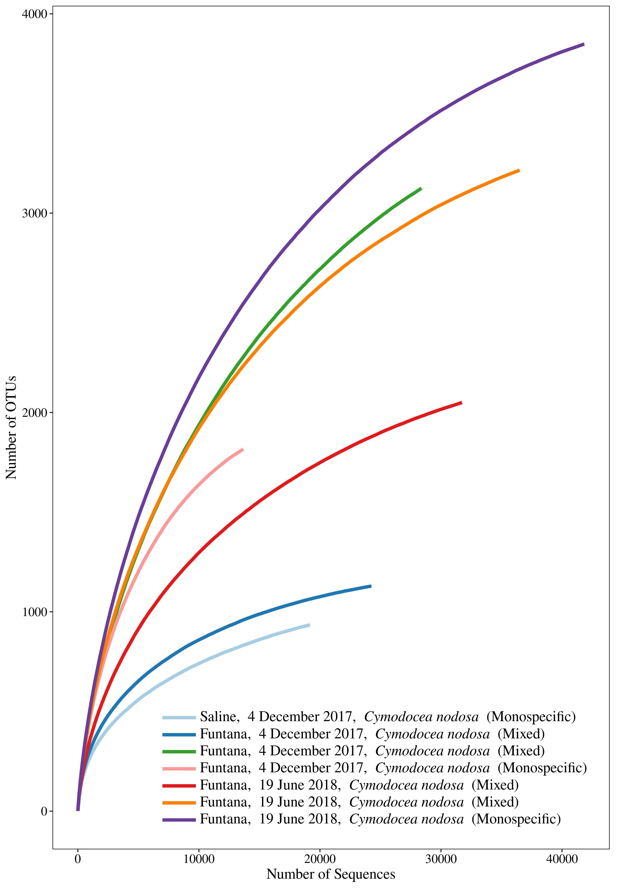

```{r knitr_settings, eval=TRUE, echo=FALSE, cache=FALSE, message=FALSE}
opts_chunk$set("tidy" = TRUE)
opts_chunk$set("echo" = FALSE)
opts_chunk$set("eval" = TRUE)
opts_chunk$set("warning" = FALSE)
opts_chunk$set("cache" = FALSE)
opts_chunk$set("message" = FALSE)

inline_hook <- function(x){
	print(x)

	if(is.list(x)){
		x <- unlist(x)
	}

	if(is.numeric(x)){
		if(abs(x - round(x)) < .Machine$double.eps^0.5){
			paste(format(x,big.mark=',', digits=0, scientific=FALSE))
		} else {
			paste(format(x,big.mark=',', digits=1, nsmall=1, scientific=FALSE))
		}
	} else {
    	paste(x)      
	}
}
knitr::knit_hooks$set(inline=inline_hook)

library("kableExtra")
```

\vspace{20mm}
Marino Korlević^1$*$^, Marsej Markovski^1^, Zihao Zhao^2^, Gerhard J. Herndl^2,3^, Mirjana Najdek^1^

1\. Center for Marine Research, Ruđer Bošković Institute, Croatia

2\. Department of Functional and Evolutionary Ecology, University of Vienna, Austria

3\. NIOZ, Department of Marine Microbiology and Biogeochemistry, Royal Netherlands Institute for Sea Research, Utrecht University, The Netherlands

^$*$^To whom correspondence should be addressed:

Marino Korlević

G. Paliaga 5, 52210 Rovinj, Croatia

Tel.: +385 52 804 768

Fax: +385 52 804 780

e-mail: marino.korlevic@irb.hr

Running title: DNA and protein isolation from macrophyte surfaces

\linenumbers
\sisetup{mode=text}
\setlength\parindent{24pt}

## Supplementary Figures

```{r out.width="80%", fig.align="center", fig.cap="Rarefaction curves of bacterial and archaeal communities from the surfaces of two marine macrophytes (\\textit{C. nodosa} and \\textit{C. cylindracea}) sampled in the Bay of Saline and the Bay of Funtana (Mixed and Monospecific Settlements) in two contrasting seasons (4 December 2017 and 19 June 2018).\\label{rarefaction}", fig.pos="H"}

```

\newpage
## Supplementary Table

```{r nseq_notus}
# 16S rRNA statistics
# Loading OTU/sample data
shared <- read_tsv("data/mothur/raw.trim.contigs.good.unique.good.filter.unique.precluster.pick.pick.pick.opti_mcc.shared")

# Calculating the number of sequences and OTUs in each sample
nseq_notus <- shared %>%
  mutate(nseq=rowSums(select(., starts_with("Otu")))) %>%
  mutate(notus=rowSums(select(., starts_with("Otu"))!=0)) %>%
  select(Group, nseq, notus) %>%
  mutate(Group=as.character(Group))

# Loading metadata 
metadata <- read_tsv("data/raw/metadata.csv")

# Joining metadata with the number of sequences and OTUs
invisible(Sys.setlocale(locale="en_GB.utf8"))
metadata_nseq_notus <- inner_join(metadata, nseq_notus, by=c("ID"="Group")) %>%
  select(ID, station, date, nseq, notus) %>%
  mutate(type=station) %>%
  select(ID, station, type, everything()) %>%
  mutate(date=as.Date(date, "%d.%m.%Y")) %>%
  mutate(date=format(date, "%d %B %Y")) %>%
  mutate(date=str_replace(date, "^0", "")) %>%
  arrange(ID) %>%
  mutate(type=str_replace(type, "^SCy$", "\\\\textit{Cymodocea nodosa} (Monospecific)")) %>%
  mutate(type=str_replace(type, "^FCyM$", "\\\\textit{Cymodocea nodosa} (Mixed)")) %>%
  mutate(type=str_replace(type, "^FCaM$", "\\\\textit{Caulerpa cylindracea} (Mixed)")) %>%
  mutate(type=str_replace(type, "^FCa$", "\\\\textit{Caulerpa cylindracea} (Monospecific)")) %>%
  mutate(station=str_replace(station, "^SCy$", "Saline")) %>%
  mutate(station=str_replace(station, "^FCyM$", "Funtana")) %>%
  mutate(station=str_replace(station, "^FCaM$", "Funtana")) %>%
  mutate(station=str_replace(station, "^FCa$", "Funtana")) %>%
  mutate(nseq=format(nseq, big.mark=","), notus=format(notus, big.mark=","))

# Generating the table
kable(metadata_nseq_notus, format="latex", booktabs=TRUE, linesep="", longtable=TRUE, escape=FALSE, col.names=c("Sample ID", "Station", "Community Type", "Date", "No. of Sequences", "No. of OTUs"), caption="Sample ID, sampling station, community type, sampling date, number of sequences and number of OTUs of each sample. The number of sequences and OTUs was calculated after exclusion of sequences without known relatives (no relative sequences) and eukaryotic, chloroplast and mitochondrial sequences.\\label{nseq_notus}", align="c") %>%
  kable_styling(latex_options=c("hold_position", "repeat_header"), font_size=9) %>%
  row_spec(0, bold=TRUE) %>%
  column_spec(1, width="6em")
```

\newpage
\blandscape
```{r metagenomic_statistics}
# Metagenomic statistics
# Loading raw sequence statistics
raw_45_R1 <- read_tsv("results/metagenomics/statistics/00raw_45_R1.txt", col_names=FALSE) %>%
  filter(X1=="Main genome scaffold total:")
raw_45_R2 <- read_tsv("results/metagenomics/statistics/00raw_45_R2.txt", col_names=FALSE) %>%
  filter(X1=="Main genome scaffold total:")

raw_47_R1 <- read_tsv("results/metagenomics/statistics/00raw_47_R1.txt", col_names=FALSE) %>%
  filter(X1=="Main genome scaffold total:")
raw_47_R2 <- read_tsv("results/metagenomics/statistics/00raw_47_R2.txt", col_names=FALSE) %>%
  filter(X1=="Main genome scaffold total:")

raw_61_R1 <- read_tsv("results/metagenomics/statistics/00raw_61_R1.txt", col_names=FALSE) %>%
  filter(X1=="Main genome scaffold total:")
raw_61_R2 <- read_tsv("results/metagenomics/statistics/00raw_61_R2.txt", col_names=FALSE) %>%
  filter(X1=="Main genome scaffold total:")

raw_63_R1 <- read_tsv("results/metagenomics/statistics/00raw_63_R1.txt", col_names=FALSE) %>%
  filter(X1=="Main genome scaffold total:")
raw_63_R2 <- read_tsv("results/metagenomics/statistics/00raw_63_R2.txt", col_names=FALSE) %>%
  filter(X1=="Main genome scaffold total:")

# Loading sequence statistics following AdapterRemoval
truncated_45_R1 <- read_tsv("results/metagenomics/statistics/01truncated_45_pair1.txt", col_names=FALSE) %>%
  filter(X1=="Main genome scaffold total:")
truncated_45_R2 <- read_tsv("results/metagenomics/statistics/01truncated_45_pair2.txt", col_names=FALSE) %>%
  filter(X1=="Main genome scaffold total:")

truncated_47_R1 <- read_tsv("results/metagenomics/statistics/01truncated_47_pair1.txt", col_names=FALSE) %>%
  filter(X1=="Main genome scaffold total:")
truncated_47_R2 <- read_tsv("results/metagenomics/statistics/01truncated_47_pair2.txt", col_names=FALSE) %>%
  filter(X1=="Main genome scaffold total:")

truncated_61_R1 <- read_tsv("results/metagenomics/statistics/01truncated_61_pair1.txt", col_names=FALSE) %>%
  filter(X1=="Main genome scaffold total:")
truncated_61_R2 <- read_tsv("results/metagenomics/statistics/01truncated_61_pair2.txt", col_names=FALSE) %>%
  filter(X1=="Main genome scaffold total:")

truncated_63_R1 <- read_tsv("results/metagenomics/statistics/01truncated_63_pair1.txt", col_names=FALSE) %>%
  filter(X1=="Main genome scaffold total:")
truncated_63_R2 <- read_tsv("results/metagenomics/statistics/01truncated_63_pair2.txt", col_names=FALSE) %>%
  filter(X1=="Main genome scaffold total:")

# Loading sequence statistics following MEGAHIT
contigs_45 <- read_tsv("results/metagenomics/statistics/03contigs_45.txt", col_names=FALSE) %>%
  filter(X1=="Main genome scaffold total:" | X1=="Main genome contig N/L50:") %>%
  separate(X2, c("X2", "X3"), sep="/", fill="right")
contigs_47 <- read_tsv("results/metagenomics/statistics/03contigs_47.txt", col_names=FALSE) %>%
  filter(X1=="Main genome scaffold total:" | X1=="Main genome contig N/L50:") %>%
  separate(X2, c("X2", "X3"), sep="/", fill="right")
contigs_61 <- read_tsv("results/metagenomics/statistics/03contigs_61.txt", col_names=FALSE) %>%
  filter(X1=="Main genome scaffold total:" | X1=="Main genome contig N/L50:") %>%
  separate(X2, c("X2", "X3"), sep="/", fill="right")
contigs_63 <- read_tsv("results/metagenomics/statistics/03contigs_63.txt", col_names=FALSE) %>%
  filter(X1=="Main genome scaffold total:" | X1=="Main genome contig N/L50:") %>%
  separate(X2, c("X2", "X3"), sep="/", fill="right")

# Loading sequence statistics following Prodigal
cds_45 <- read_tsv("results/metagenomics/statistics/04cds_nucl_45.txt", col_names=FALSE) %>%
  filter(X1=="Main genome scaffold total:")
cds_47 <- read_tsv("results/metagenomics/statistics/04cds_nucl_47.txt", col_names=FALSE) %>%
  filter(X1=="Main genome scaffold total:")
cds_61 <- read_tsv("results/metagenomics/statistics/04cds_nucl_61.txt", col_names=FALSE) %>%
  filter(X1=="Main genome scaffold total:")
cds_63 <- read_tsv("results/metagenomics/statistics/04cds_nucl_63.txt", col_names=FALSE) %>%
  filter(X1=="Main genome scaffold total:")

# Loading sequence statistics following eggNOG mapper
eggnog_45 <- read_tsv("results/metagenomics/statistics/07eggnog_45.txt", col_names=FALSE)
eggnog_47 <- read_tsv("results/metagenomics/statistics/07eggnog_47.txt", col_names=FALSE)
eggnog_61 <- read_tsv("results/metagenomics/statistics/07eggnog_61.txt", col_names=FALSE)
eggnog_63 <- read_tsv("results/metagenomics/statistics/07eggnog_63.txt", col_names=FALSE)

# Combining statistical data in a table
metagenomic_statistics <- tibble(
  ID=c(45, 47, 61, 63),
  raw_R1=c(raw_45_R1$X2, raw_47_R1$X2, raw_61_R1$X2, raw_63_R1$X2),
  raw_R2=c(raw_45_R2$X2, raw_47_R2$X2, raw_61_R2$X2, raw_63_R2$X2),
  truncated_R1=c(truncated_45_R1$X2, truncated_47_R1$X2, truncated_61_R1$X2, truncated_63_R1$X2),
  truncated_R2=c(truncated_45_R2$X2, truncated_47_R2$X2, truncated_61_R2$X2, truncated_63_R2$X2),
  contigs=c(contigs_45$X2[1], contigs_47$X2[1], contigs_61$X2[1], contigs_63$X2[1]),
  N50=c(contigs_45$X2[2], contigs_47$X2[2], contigs_61$X2[2], contigs_63$X2[2]),
  L50=c(contigs_45$X3[2], contigs_47$X3[2], contigs_61$X3[2], contigs_63$X3[2]),
  cds=c(cds_45$X2, cds_47$X2, cds_61$X2, cds_63$X2),
  eggnog=c(eggnog_45$X2, eggnog_47$X2, eggnog_61$X2, eggnog_63$X2)
  ) %>%
  mutate(L50=str_replace(L50, " KB", "")) %>%
  mutate(L50=str_replace(L50, "\\.", ""))

# Loading metagenomic metadata
metadata_metagenomics <- read_tsv("data/raw/metadata_metagenomics.csv")

# Joining metagenomic metadata with metagenomic statistical data
invisible(Sys.setlocale(locale="en_GB.utf8"))
metadata_metagenomic_statistics <- inner_join(metadata_metagenomics, metagenomic_statistics, by=c("ID"="ID")) %>%
  select(ID, station, date, raw_R1, contigs, N50, L50, cds, eggnog) %>%
  mutate(type=station) %>%
  select(ID, station, type, everything()) %>%
  mutate(date=as.Date(date, "%d.%m.%Y")) %>%
  mutate(date=format(date, "%d %B %Y")) %>%
  mutate(date=str_replace(date, "^0", "")) %>%
  arrange(ID) %>%
  mutate(type=str_replace(type, "^SCy$", "\\\\textit{Cymodocea nodosa} (Monospecific)")) %>%
  mutate(type=str_replace(type, "^FCyM$", "\\\\textit{Cymodocea nodosa} (Mixed)")) %>%
  mutate(type=str_replace(type, "^FCaM$", "\\\\textit{Caulerpa cylindracea} (Mixed)")) %>%
  mutate(type=str_replace(type, "^FCa$", "\\\\textit{Caulerpa cylindracea} (Monospecific)")) %>%
  mutate(station=str_replace(station, "^SCy$", "Saline")) %>%
  mutate(station=str_replace(station, "^FCyM$", "Funtana")) %>%
  mutate(station=str_replace(station, "^FCaM$", "Funtana")) %>%
  mutate(station=str_replace(station, "^FCa$", "Funtana")) %>%
  mutate_at(vars(c(raw_R1, contigs, N50, L50, cds, eggnog)), list(~as.numeric(.))) %>%
  mutate(raw_R1=format(raw_R1, big.mark=","),
         contigs=format(contigs, big.mark=","),
         N50=format(N50, big.mark=","),
         L50=format(L50, big.mark=","),
         cds=format(cds, big.mark=","),
         eggnog=format(eggnog, big.mark=","))

# Generating the table
kable(metadata_metagenomic_statistics, format="latex", booktabs=TRUE, linesep="", longtable=TRUE, escape=FALSE, col.names=linebreak(c("Sample ID", "Station", "Community Type", "Date", "No. of Raw\nSequence Pairs", "No. of\nContigs", "N50\\textsuperscript{*}", "L50 (bp)\\textsuperscript{*}", "No. of\nPredicted\nCDS", "No. of\nAnnotated\nCDS"), align="c"), caption="Sample ID, sampling station, community type, sampling date, number of raw sequence pairs, number of assembled contigs by MEGAHIT, N50 and L50 assembly statistics, number of predicted coding sequences (CDS) by Prodigal and number of eggNOGmapper annotated CDS.\\label{metagenomic_statistics}", align="c") %>%
  kable_styling(latex_options=c("hold_position", "repeat_header"), font_size=9) %>%
  row_spec(0, bold=TRUE) %>%
  column_spec(1, width="5em") %>%
  footnote(symbol="The notation was preserved from the original output of BBTools stats.sh.")
```

\elandscape
\newpage
```{r metagenomic_taxonomy}
# Metagenomic taxonomy
# Loading summary taxonomy files (phylum)
phylum_45 <- read_tsv("results/metagenomics/taxonomy/45.phylum.tsv") %>%
  add_column(sample = 45, .before = "phylum") %>%
  filter(!is.na(phylum)) %>%
  mutate(cds_relative = cds / sum(cds) * 100) %>%
  mutate(rpkm_relative = rpkm / sum(rpkm) * 100) %>%
  arrange(desc(rpkm_relative)) %>%
  top_n(10)
phylum_47 <- read_tsv("results/metagenomics/taxonomy/47.phylum.tsv") %>%
  add_column(sample = 47, .before = "phylum") %>%
  filter(!is.na(phylum)) %>%
  mutate(cds_relative = cds / sum(cds) * 100) %>%
  mutate(rpkm_relative = rpkm / sum(rpkm) * 100) %>%
  arrange(desc(rpkm_relative)) %>%
  top_n(10)
phylum_61 <- read_tsv("results/metagenomics/taxonomy/61.phylum.tsv") %>%
  add_column(sample = 61, .before = "phylum") %>%
  filter(!is.na(phylum)) %>%
  mutate(cds_relative = cds / sum(cds) * 100) %>%
  mutate(rpkm_relative = rpkm / sum(rpkm) * 100) %>%
  arrange(desc(rpkm_relative)) %>%
  top_n(10)
phylum_63 <- read_tsv("results/metagenomics/taxonomy/63.phylum.tsv") %>%
  add_column(sample = 63, .before = "phylum") %>%
  filter(!is.na(phylum)) %>%
  mutate(cds_relative = cds / sum(cds) * 100) %>%
  mutate(rpkm_relative = rpkm / sum(rpkm) * 100) %>%
  arrange(desc(rpkm_relative)) %>%
  top_n(10)

# Combining summary taxonomy files (phylum)
metagenomic_phylum <- bind_rows(phylum_45, phylum_47, phylum_61, phylum_63)

# Loading metagenomic metadata 
metadata_metagenomics <- read_tsv("data/raw/metadata_metagenomics.csv")

# Joining metagenomic metadata with metagenomic taxonomy data
invisible(Sys.setlocale(locale="en_GB.utf8"))
metadata_metagenomic_phylum <- inner_join(metadata_metagenomics, metagenomic_phylum, by=c("ID"="sample")) %>%
  select(ID, station, date, phylum, cds, cds_relative, rpkm, rpkm_relative) %>%
  mutate(type=station) %>%
  select(ID, station, type, everything()) %>%
  mutate(date=as.Date(date, "%d.%m.%Y")) %>%
  mutate(date=format(date, "%d %B %Y")) %>%
  mutate(date=str_replace(date, "^0", "")) %>%
  arrange(ID) %>%
  mutate(phylum=str_replace(phylum, "^Proteobacteria$", "\\\\textit{Proteobacteria}")) %>%
  mutate(phylum=str_replace(phylum, "^Cyanobacteria$", "\\\\textit{Cyanobacteria}")) %>%
  mutate(phylum=str_replace(phylum, "^Bacteroidetes$", "\\\\textit{Bacteroidetes}")) %>%
  mutate(phylum=str_replace(phylum, "^Actinobacteria$", "\\\\textit{Actinobacteria}")) %>%
  mutate(phylum=str_replace(phylum, "^Planctomycetes$", "\\\\textit{Planctomycetes}")) %>%
  mutate(phylum=str_replace(phylum, "^Verrucomicrobia$", "\\\\textit{Verrucomicrobia}")) %>%
  mutate(phylum=str_replace(phylum, "^Chloroflexi$", "\\\\textit{Chloroflexi}")) %>%
  mutate(phylum=str_replace(phylum, "^Chlorophyta$", "\\\\textbf{Chlorophyta}")) %>%
  mutate(phylum=str_replace(phylum, "^Streptophyta$", "\\\\textbf{Streptophyta}")) %>%  
  mutate(cds=format(cds, big.mark=","),
         cds_relative=format(round(cds_relative, 2), big.mark=',', nsmall=1),
         rpkm=format(rpkm, big.mark=","),
         rpkm_relative=format(round(rpkm_relative, 2), big.mark=',', nsmall=1))

# Generating the table
select(metadata_metagenomic_phylum, phylum, cds, cds_relative, rpkm, rpkm_relative) %>%
kable(format="latex", booktabs=TRUE, linesep="", longtable=TRUE, escape=FALSE, col.names=linebreak(c("Phylum", "No. of CDS", "CDS (\\%)", "Summed RPKM", "RPKM (\\%)"), align="c"), caption="Phyla into which CDS were classifed, number and proportion of CDS in different phyla and sum of coding sequences' RPKM (Reads Per Kilobase Million) and their proportion in different phyla. Data are derived from sequenced metagenomes. Each metagenomic sample is labeled with sampling station, community type, sampling date and sample ID. For each sample top ten phyla based on RPKM were selected. CDS that were not successfully classified were excluded from the dataset.\\label{metagenomic_taxonomy}", align="c") %>%
  kable_styling(latex_options=c("hold_position", "repeat_header"), font_size=9, full_width=TRUE) %>%
  row_spec(0, bold=TRUE) %>%
  group_rows("Funtana, \\\\textit{Cymodocea nodosa} (Monospecific), 14 December 2017 (sample ID: 45)", 1, 10, escape=FALSE, latex_gap_space="0.6 em") %>%
  group_rows("Funtana, \\\\textit{Caulerpa cylindracea} (Monospecific), 14 December 2017 (sample ID: 47)", 11, 20, escape=FALSE, latex_gap_space="0.6 em") %>%
  group_rows("Funtana, \\\\textit{Cymodocea nodosa} (Mixed), 19 June 2018 (sample ID: 61)", 21, 30, escape=FALSE, latex_gap_space="0.9 em") %>%
  group_rows("Funtana, \\\\textit{Caulerpa cylindracea} (Monospecific), 19 June 2018 (sample ID: 63)", 31, 40, escape=FALSE, latex_gap_space="0.6 em")
```